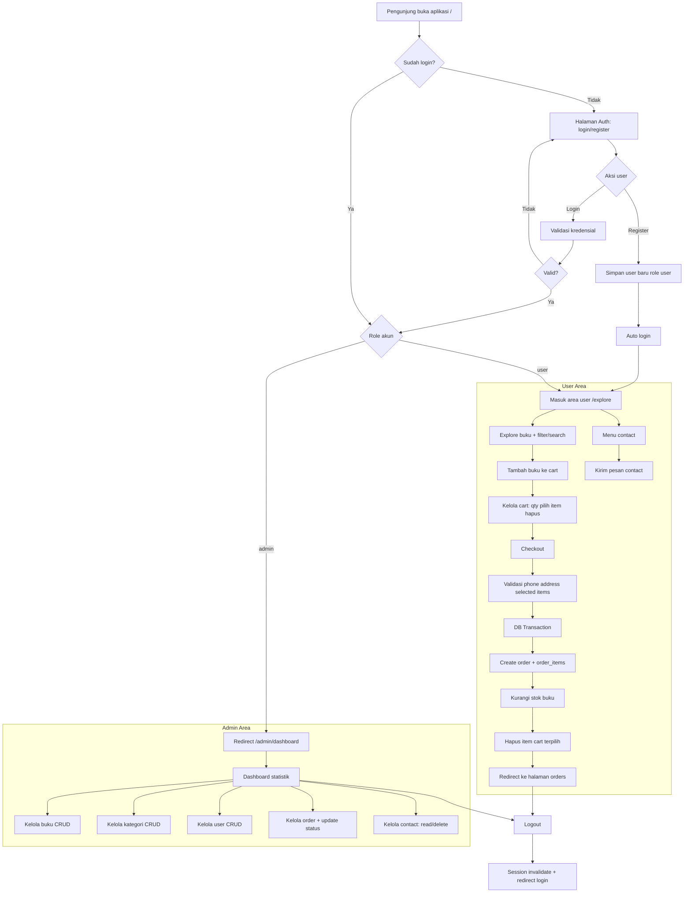
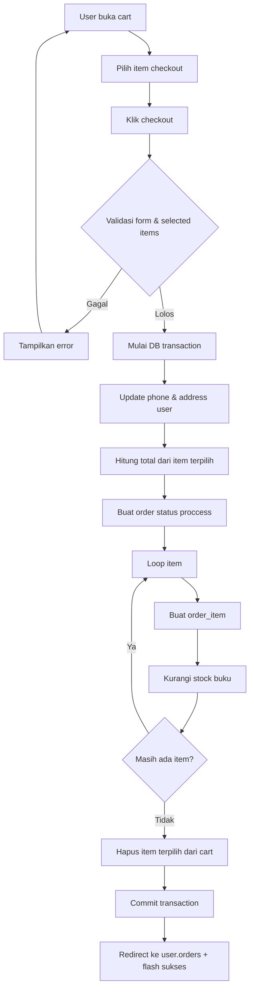

# BookStore Flowchart

## 1) High-Level Project Flow

## 2) Detail Checkout Flow

## 3) Mapping Source Code

- Routing utama: `routes/web.php`
- Role guard: `app/Http/Middleware/RoleMiddleware.php`
- Auth flow: `app/Livewire/Auth/Index.php`
- User flow: `app/Livewire/User/Explore.php`, `app/Livewire/User/Cart.php`, `app/Livewire/User/Order.php`, `app/Livewire/User/Contact.php`
- Admin flow: `app/Livewire/Admin/Dashboard.php`, `app/Livewire/Admin/Book/Index.php`, `app/Livewire/Admin/Category/Index.php`, `app/Livewire/Admin/User/Index.php`, `app/Livewire/Admin/Order/Index.php`, `app/Livewire/Admin/Contact/Index.php`
